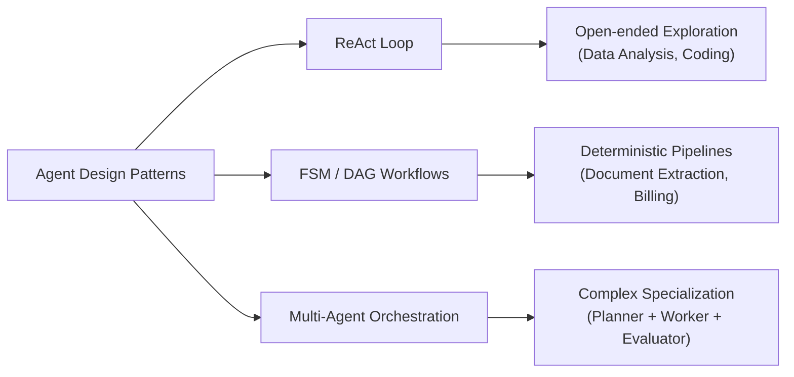
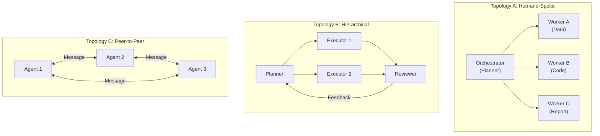

# Building Autonomous AI Agents: Architecture, Parameterization, and Implementation Master Guide

This document is a comprehensive, production-grade guide for designing, parameterizing, and building autonomous AI agents — from minimal prototypes to complex, enterprise-scale agentic systems. It spans fundamental paradigms, minimal architectures, deep architectural facets, multi-agent orchestration, evaluation frameworks, and deployment operations.

---

## 1. Foundations: What is an Agent & When (Not) to Use One

### 1.1 Definition

An **AI Agent** is an autonomous system that uses a Cognitive Engine (LLM) to perceive environment state, reason about goals, execute tools/actions, observe results, and iterate until an objective is achieved.

```
       ┌─────────────────────────────────────────────────────────┐
       │                 User Goal / Environment                 │
       └──────────────────────────┬──────────────────────────────┘
                                  │
                                  ▼
┌───────────────────────────────────────────────────────────────────────┐
│                           AGENT CONTROL LOOP                          │
│                                                                       │
│  ┌────────────────────┐   Prompt    ┌──────────────────────────────┐  │
│  │   Context Engine   ├────────────►│       Cognitive Brain        │  │
│  │ (Memory, SOP, State│             │ (LLM + Tool Manifests)       │  │
│  └─────────▲──────────┘             └──────────────┬───────────────┘  │
│            │                                       │ Tool Call        │
│            │ Observation                           ▼                  │
│  ┌─────────┴──────────┐             ┌──────────────────────────────┐  │
│  │ Guardrails & State ├─────────────┤    Tool Execution Sandbox    │  │
│  │    Checkpoints     │◄────────────┤ (Python, DB, Terminal, APIs) │  │
│  └────────────────────┘ Output/Err  └──────────────────────────────┘  │
└───────────────────────────────────────────────────────────────────────┘
```

### 1.2 When to Use an Agent vs. Simpler Alternatives

Not every LLM-powered feature needs an agent. Over-engineering with agents when a simpler solution suffices wastes cost, adds latency, and increases failure surface.

**Decision Matrix: Input Complexity × Output Determinism**

| | **Deterministic Output** | **Open-Ended Output** |
| :--- | :--- | :--- |
| **Single-Step Input** | ❌ **Single LLM Call** (classification, extraction, summarization) | ❌ **Single LLM Call** with structured output schema |
| **Multi-Step Input** (requires tool use, iteration) | ✅ **FSM/DAG Agent** (deterministic pipeline) | ✅ **ReAct Agent** (exploratory reasoning) |
| **Multi-Domain / Large Scope** | ✅ **Multi-Agent System** (delegated specialists) | ✅ **Multi-Agent System** with planner |

**Use an Agent when**:
- The task requires iterative multi-step reasoning.
- The agent must select from and invoke multiple tools dynamically.
- The execution plan cannot be fully known in advance (the LLM must adapt based on intermediate results).

**Don't use an Agent when**:
- The task is a single classification, extraction, or transformation — a single structured LLM call with a JSON schema is cheaper, faster, and more reliable.
- The workflow is fully deterministic and pre-known — use a traditional pipeline or rule-based system.
- Latency requirements are sub-second — agent loops introduce multi-turn latency.

---

## 2. Architecture Spectrum: ReAct vs. FSM vs. Multi-Agent



### 2.1 ReAct (Reasoning and Acting)
- **Mechanism**: An iterative `while` loop where the LLM produces thoughts and tool invocations, receives tool execution feedback (observations), and updates its internal plan dynamically.
- **Best For**: Exploratory tasks, data analysis, software debugging, complex problem solving.
- **Tradeoff**: Maximum flexibility, but highest risk of runaway loops and token burn.

### 2.2 Finite State Machines (FSMs) & Directed Acyclic Graphs (DAGs)
- **Mechanism**: Control flow is hardcoded into state nodes. The developer designs the graph; the LLM evaluates specific transitions or extracts structured outputs within nodes. Frameworks like **LangGraph** or **AutoGen** formalize this.
- **Best For**: Highly regulated, deterministic business processes (e.g., invoice processing, KYC validation).
- **Tradeoff**: Highly predictable, but brittle to novel edge cases the graph designer didn't anticipate.

### 2.3 Multi-Agent Orchestration
- **Mechanism**: Specialized agents (e.g., Planner, Coder, Reviewer) delegate tasks to one another via structured message passing. Each agent has its own context window, tools, and system prompt.
- **Best For**: Large-scope tasks where context isolation prevents context-window bloat and where different sub-tasks benefit from specialized instructions.
- **Tradeoff**: Powerful decomposition, but introduces coordination complexity, failure propagation, and inter-agent communication overhead.

> [!NOTE]
> These patterns are not mutually exclusive. Enterprise systems often combine them: a **DAG orchestrator** routes to specialized **ReAct sub-agents**, each running in isolated context windows with dedicated tool sets.

---

## 3. The Simplest Agent Architecture (Minimal Blueprint)

The simplest viable agent is a **Single-Loop ReAct Agent** written in pure Python. It requires zero complex frameworks and relies on four clean primitives:
1. **System Prompt**: Defines persona and tool usage guidelines.
2. **LLM Client Abstraction**: Sends messages and tool schemas to the model API.
3. **Bounded `while` Loop**: Controls iteration with a mandatory `max_loops` safety threshold.
4. **Tool Dispatcher**: Maps tool calls to executable Python functions.

### 3.1 Production-Grade Minimal Implementation

```python
import json
import logging
from typing import Dict, Any, List, Callable

logger = logging.getLogger(__name__)

class MinimalAgent:
    """
    A minimal, self-contained ReAct agent with explicit loop safety
    and provider-agnostic tool execution.
    """
    def __init__(
        self,
        llm_client: Any,
        tools: Dict[str, Callable],
        system_prompt: str,
        max_loops: int = 10
    ):
        self.client = llm_client
        self.tools = tools
        self.system_prompt = system_prompt
        self.max_loops = max_loops

    def run(self, user_query: str) -> str:
        # Initialize conversation state with cached static prompt prefix
        messages = [
            {"role": "system", "content": self.system_prompt},
            {"role": "user", "content": user_query}
        ]

        for loop_idx in range(1, self.max_loops + 1):
            logger.info(f"[Loop {loop_idx}/{self.max_loops}] Calling LLM...")
            
            # 1. Reason: Request model output with tool schemas
            response = self.client.generate(messages=messages, tools=self.get_tool_schemas())

            # 2. Check for Final Answer
            if response.final_answer:
                logger.info(f"[Completed] Final answer on step {loop_idx}.")
                return response.final_answer

            # 3. Handle potentially multiple parallel tool calls
            for tool_call in response.tool_calls:
                tool_name = tool_call.name
                tool_args = tool_call.arguments
                logger.info(f"[Action] Tool: {tool_name}({json.dumps(tool_args)})")

                # 4. Act: Execute Tool Safely
                if tool_name in self.tools:
                    try:
                        observation = self.tools[tool_name](**tool_args)
                        status = "SUCCESS"
                    except Exception as e:
                        observation = f"Tool Execution Error: {str(e)}"
                        status = "ERROR"
                else:
                    observation = f"Error: Tool '{tool_name}' is not registered."
                    status = "NOT_FOUND"

                # 5. Observe: Append turn state to history
                messages.append({
                    "role": "assistant",
                    "tool_calls": [{"id": tool_call.id, "name": tool_name, "arguments": tool_args}]
                })
                messages.append({
                    "role": "tool",
                    "tool_call_id": tool_call.id,
                    "content": str(observation)
                })

        return f"Agent stopped: Exceeded safety threshold of {self.max_loops} loops."

    def get_tool_schemas(self) -> List[Dict[str, Any]]:
        return [fn._json_schema for fn in self.tools.values() if hasattr(fn, "_json_schema")]
```

> [!IMPORTANT]
> **ReAct Loop Safety Rule**: Never run an unbounded autonomous `while True:` loop. Always specify an explicit `max_loops` threshold (e.g., 10–15 steps) to prevent catastrophic token burn during hallucination or tool failure loops.

### 3.2 Production Hardening Checklist

The minimal agent above is pedagogically clean but has gaps that will bite in production. Before deploying, ensure you address each of these:

| Concern | Problem in Minimal Code | Production Fix |
| :--- | :--- | :--- |
| **Parallel tool calls** | Many LLMs emit multiple tool calls per turn | Handle `response.tool_calls` as a list (shown above) |
| **Token counting** | Messages list grows unbounded within `max_loops` | Add token estimation; trigger context pruning (see §5.4) |
| **LLM API retries** | `client.generate()` can throw network errors | Wrap in exponential backoff with jitter (see §5.2) |
| **Structured logging** | `print()` is not production-grade | Use `structlog` or `logging` with JSON output |
| **Tool execution timeout** | Tool execution has no timeout guard | Wrap in `concurrent.futures.ThreadPoolExecutor` with timeout |
| **Output truncation** | Tool outputs can be massive (e.g., full DB dump) | Truncate STDOUT/STDERR to configurable char limit, preserving head+tail |
| **Checkpoint persistence** | Crash loses all progress | Serialize state after each turn (see §5.4) |

---

## 4. Parameterization & Declarative Configuration

To keep agent code modular, maintainable, and configurable across dev, staging, and production, decouple execution logic from agent metadata using a declarative YAML/JSON configuration spec.

### 4.1 Parameterization Matrix

| Category | Parameter Key | Example Values | Purpose |
| :--- | :--- | :--- | :--- |
| **Model Specification** | `provider` | `anthropic`, `openai`, `huggingface` | Provider agnosticism; swap LLM vendors seamlessly. |
| | `model_name` | `claude-3-5-sonnet`, `qwen2.5-72b` | Cost vs. intelligence tuning. |
| | `temperature` | `0.0` to `0.7` | Output determinism and creativity. |
| | `max_tokens` | `4096` | Single-turn token output cap. |
| **Control Guardrails** | `max_loops` | `10` – `15` | Hard limit on ReAct loop turns. |
| | `execution_timeout` | `30` (seconds) | Subprocess / API execution timeout. |
| | `hitl_threshold` | `3` (consecutive failures) | Trigger Human-in-the-Loop after N failures. |
| | `use_checklist` | `true` / `false` | Toggle state guardrails dynamically. |
| **Retry & Resilience** | `retry_max_attempts` | `3` | Max retries for transient LLM API errors. |
| | `retry_base_delay_sec` | `1.0` | Base delay for exponential backoff. |
| | `circuit_breaker_threshold` | `5` | Failures before switching to fallback provider. |
| **Behavior & Prompts** | `base_prompt_path` | `prompts/system_base.md` | External prompt file for version control. |
| | `sop_directory` | `sops/` | Declarative Standard Operating Procedures location. |
| **Tool Registry & Sandbox** | `sandbox_type` | `subprocess`, `docker`, `e2b` | Isolation level based on deployment trust. |
| | `enabled_tools` | `["execute_python", "sql_query"]` | Dynamic feature flagging per agent role. |
| | `tool_output_max_chars` | `10000` | Truncation limit for tool outputs. |
| **Memory & Resiliency** | `context_pruning_limit` | `100000` (tokens) | Threshold to trigger context summarization. |
| | `persistence_backend` | `sqlite`, `jsonl`, `redis` | Session state storage for crash recovery. |
| **Cost Governance** | `session_token_budget` | `500000` | Hard cap on total tokens per session. |
| | `model_tier_routing` | `{classify: "flash", reason: "opus"}` | Route cheap tasks to fast models. |

### 4.2 Complete Declarative Specification Schema (`spec.yaml`)

```yaml
agent:
  name: "data_analyst"
  version: "1.0.0"
  description: "Autonomous data analysis and visual chart generation agent"

model:
  provider: "anthropic"
  fallback_provider: "huggingface"
  model_name: "claude-3-5-sonnet-20241022"
  fallback_model: "Qwen/Qwen2.5-72B-Instruct"
  temperature: 0.0
  max_tokens: 4096

guardrails:
  max_loops: 15
  execution_timeout_seconds: 30
  hitl_on_consecutive_errors: 3
  use_checklist: false

retry:
  max_attempts: 3
  base_delay_seconds: 1.0
  max_delay_seconds: 30.0
  circuit_breaker_failure_threshold: 5

paths:
  base_prompt: "data_analyst/prompts/base_system.md"
  sop_dir: "data_analyst/sops/"
  output_dir: "data_analyst/outputs/"

execution:
  sandbox: "docker"
  enabled_tools:
    - name: "execute_python"
      idempotent: true
      timeout_seconds: 30
    - name: "send_notification"
      idempotent: false
      timeout_seconds: 10
  tool_output_max_chars: 10000

memory:
  context_prune_threshold_tokens: 100000
  checkpoint_enabled: true
  checkpoint_backend: "jsonl"

cost:
  session_token_budget: 500000
  alert_at_percent: 80
```

---

## 5. Deep Dive: Architectural Facets

```
┌──────────────────────────────────────────────────────────────────────────────┐
│                          5.7 Observability & Tracing                         │
│          (Dual Transcripts: transcript.jsonl / transcript_full.jsonl)        │
├──────────────────────────────────────────────────────────────────────────────┤
│  5.10 Input Processing     │  5.8 Planning & Task Decomposition             │
│    - Intent Classifier     │    - Plan-then-Execute / Dynamic Re-Planning   │
│    - Complexity Estimator  │    - Checklist Grounding                       │
│    - SOP/Skill Router      │                                                │
├────────────────────────────┼─────────────────────────────────────────────────┤
│  5.1 Cognitive Brain       │  5.2 Control & Orchestration                    │
│    - BaseLLMClient         │    - ReAct Loop Engine                          │
│    - Prompt Caching        │    - Retry & Circuit Breakers                   │
│    - Structured Outputs    │    - Human-in-the-Loop Triggers                 │
├────────────────────────────┼─────────────────────────────────────────────────┤
│  5.3 Tool Design Patterns  │  5.4 Memory & Context                           │
│    - Pydantic Schemas      │    - Short-Term History & Context Pruning        │
│    - Idempotency Tags      │    - State Hydration & Checkpoints               │
│    - MCP / Dynamic Disc.   │    - Long-Term Memory (Cross-Session)            │
│    - Output Contracts      │    - Declarative SOP / Prompt-RAG                │
├────────────────────────────┼─────────────────────────────────────────────────┤
│  5.9 Reflection &          │  5.13 Grounding & Knowledge Retrieval (RAG)     │
│    Self-Critique           │    - Agentic RAG vs. Pipeline RAG               │
│    - Inner Critic Loop     │    - Retrieval as a Tool                        │
│    - Verify-then-Return    │    - Grounding Verification                     │
├────────────────────────────┴─────────────────────────────────────────────────┤
│  5.5 Error Taxonomy & Escalation Ladder                                      │
├──────────────────────────────────────────────────────────────────────────────┤
│  5.11 Output Validation & Response Guardrails (PII, Schema, Safety)          │
├──────────────────────────────────────────────────────────────────────────────┤
│  5.12 Conversation Management (Clarification, Follow-ups, Corrections)       │
├──────────────────────────────────────────────────────────────────────────────┤
│  5.6 Security, Auth, Multi-Tenancy & Cost Governance                         │
└──────────────────────────────────────────────────────────────────────────┘
```

### 5.1 The Cognitive Brain (Model Abstraction & Prompt Caching)

**Provider Agnosticism**: Abstract model providers behind a unified interface (`BaseLLMClient`). Application logic should never directly invoke vendor SDKs. This allows seamless failover from one provider to another (e.g., Anthropic → Hugging Face) without touching agent loop code.

**Prompt Caching Friendliness**: Place large, static context blocks (system prompts, tool definitions, reference documentation) at the **very beginning** of the prompt payload. Keep this prefix static across turns so providers (Anthropic, Gemini) can cache the token computation, reducing cost and latency by up to 80%.

```
┌────────────────────────────────────────────────────────────┐
│ STATIC PREFIX (CACHED)                                      │
│ ┌────────────────────────────────────────────────────────┐  │
│ │ System Prompt + Tool Schemas + Base SOP Instructions   │  │
│ └────────────────────────────────────────────────────────┘  │
├────────────────────────────────────────────────────────────┤
│ DYNAMIC SUFFIX (NOT CACHED)                                 │
│ ┌────────────────────────────────────────────────────────┐  │
│ │ Conversation History + Injected SOP + Current Query    │  │
│ └────────────────────────────────────────────────────────┘  │
└────────────────────────────────────────────────────────────┘
```

**Structured Outputs**: Never parse model output using custom regex or string splitting. Always rely on native API tool calling (function calling) or Pydantic/JSON schema enforcement at the API boundary. This guarantees structural validity and eliminates an entire class of parsing bugs.

### 5.2 Control & Orchestration (Retry, Circuit Breakers, HITL)

The control layer manages execution transitions, failure recovery, and human escalation.

**Retry with Exponential Backoff & Jitter**: LLM API calls are inherently unreliable (rate limits, network timeouts, server errors). Every `client.generate()` call must be wrapped in a retry handler:

```python
import random
import time

def retry_with_backoff(fn, max_attempts=3, base_delay=1.0, max_delay=30.0):
    """
    Retries a function call with exponential backoff and jitter.
    Handles transient errors (429 rate limits, 500 server errors, timeouts).
    """
    for attempt in range(1, max_attempts + 1):
        try:
            return fn()
        except (RateLimitError, TimeoutError, ConnectionError) as e:
            if attempt == max_attempts:
                raise  # Exhausted retries — escalate
            delay = min(base_delay * (2 ** (attempt - 1)), max_delay)
            jitter = random.uniform(0, delay * 0.5)
            time.sleep(delay + jitter)
```

**Circuit Breaker Pattern**: After N consecutive provider failures (e.g., 5), stop retrying the primary provider and automatically switch to the fallback provider defined in config. This prevents cascading failures and wasted spend during provider outages.

```
Primary Provider (Anthropic)
    │
    ├── Success → Continue
    ├── Failure 1–4 → Retry with backoff
    └── Failure 5 → Circuit OPEN → Switch to Fallback Provider (HuggingFace)
                                          │
                                          └── Continue agent loop on fallback
```

**Human-in-the-Loop (HITL) Triggers**: When an agent experiences N consecutive tool execution failures (`hitl_threshold` in config), the loop pauses and requests human intervention rather than exhausting `max_loops`. This is critical for production agents where silent failure wastes resources.

**Idempotency Considerations for Retries**: If a tool call is retried (e.g., due to a timeout where the result was lost), will it produce duplicate side effects? Tools tagged as `idempotent: false` (like `send_email`) must NOT be retried blindly — use deduplication tokens or skip-on-timeout strategies.

### 5.3 Tool Design Patterns (Schemas, Idempotency, Output Contracts)

Tools are the agent's hands. Bad tool design produces bad agents regardless of model quality.

**Tool Anatomy**: Every tool must define:
1. **Name**: Concise, action-verb prefix (e.g., `execute_sql`, `read_file`, not `sql` or `file`).
2. **Description**: The LLM reads this to decide when to use the tool. A vague description → wrong tool selection.
3. **Input Schema**: Strict Pydantic/JSON Schema for every argument. No `**kwargs` or untyped dicts.
4. **Output Contract**: Always return structured results, never raw strings.
5. **Side Effect Declaration**: `idempotent: true/false` — can this be safely retried?

**Structured Tool Definition Example**:

```python
from pydantic import BaseModel, Field
from typing import Literal

class ExecuteSQLInput(BaseModel):
    query: str = Field(description="The SQL query to execute. Must be read-only (SELECT).")
    database: str = Field(default="analytics", description="Target database name.")

class ToolResult(BaseModel):
    status: Literal["success", "error"]
    data: str = Field(description="The result data or error message.")
    row_count: int | None = Field(default=None, description="Number of rows returned.")

@tool(
    name="execute_sql",
    description="Execute a read-only SQL query against the analytics database. "
                "Returns tabular results. Use for data exploration and aggregation.",
    idempotent=True,
    timeout_seconds=30,
)
def execute_sql(input: ExecuteSQLInput) -> ToolResult:
    """Pydantic enforces input validation. Output is always ToolResult."""
    try:
        result = db.execute(input.query)
        return ToolResult(status="success", data=result.to_csv(), row_count=len(result))
    except Exception as e:
        return ToolResult(status="error", data=str(e))
```

**Tool Output Contracts**: Always return structured results (`{"status": "success", "data": ...}`) rather than raw strings. This enables downstream parsing without regex and allows the LLM to reason about success vs. failure reliably.

**Tool Composition Boundaries**: A tool should NOT internally call other tools. Tool composition should be orchestrated by the LLM's reasoning, not hidden in tool implementations. This keeps execution transparent and debuggable.

**Tool Discovery & Dynamic Registration (MCP)**: In enterprise environments, agents need to connect to dozens of data sources and services. Rather than hardcoding every tool integration, use the **Model Context Protocol (MCP)** — an emerging standard (spearheaded by Anthropic) that decouples tools from agents.

```
Static Tool Registry (Traditional)          Dynamic Tool Discovery (MCP)
┌──────────────────────┐                    ┌──────────────────────┐
│  Agent Code          │                    │  Agent Code          │
│  ├── tool_a.py       │                    │  └── MCP Client      │
│  ├── tool_b.py       │                    │       │              │
│  └── tool_c.py       │                    │       ├──► Postgres MCP Server
│  (All hardcoded)     │                    │       ├──► Slack MCP Server
└──────────────────────┘                    │       └──► Jira MCP Server
                                            └──────────────────────┘
```

- **MCP Servers**: Lightweight, self-describing tool endpoints. Each server advertises its available tools, input schemas, and capabilities via a standard protocol.
- **Runtime Discovery**: The agent queries connected MCP servers at startup (or dynamically) to learn what tools are available — no custom integration code per service.
- **Security Boundary**: MCP servers handle their own authentication and data access, so the agent never needs raw database credentials.
- **When to Use Static vs. Dynamic**:
  - *Static Registry*: Small, stable tool sets where you control all integrations (e.g., early development, single-purpose agents).
  - *Dynamic Discovery (MCP)*: Growing tool ecosystems, multi-tenant platforms, or when external teams provide tool servers independently.

### 5.4 Memory, Context & State Hydration

**Short-Term History**: The conversation thread (system prompt + user query + assistant turns + tool results) maintained directly in the LLM context window.

**Context Pruning**: When conversation length approaches token limits, summarize older turns while retaining:
- The initial system prompt and tool schemas (always preserved).
- The most recent N assistant turns (preserves reasoning continuity).
- A synthesized summary of all older turns.

**State Hydration & Checkpoints**: Record a persistent state record after each turn:

```json
{
  "checkpoint_id": "step_04",
  "timestamp": "2026-07-29T17:00:00Z",
  "loop_index": 4,
  "messages_hash": "a3f8c1...",
  "active_sop": "data_cleaning",
  "checklist_state": {"step_1": "done", "step_2": "in_progress"},
  "total_tokens_used": 45230
}
```

If the process crashes or encounters a network partition, the agent rehydrates its state and resumes from the last known good checkpoint instead of restarting from scratch.

**Declarative SOPs & Dynamic Injection**: Keep base prompts minimal and static (for caching). Store procedural runbooks as standalone markdown files (`sops/data_cleaning.md`, `sops/visualization.md`). A routing mechanism evaluates the user's intent and appends only the relevant SOP to the prompt at runtime.

**Prompt-RAG for Enterprise Scale**: When SOPs number in the hundreds, keyword-based routing becomes unmaintainable. Replace with a **Prompt-RAG** system: embed all SOPs in a vector database and retrieve the top-K relevant procedures via semantic similarity search on the user query.

**Long-Term Memory (Cross-Session Persistence)**: The mechanisms above (short-term history, checkpoints) all operate *within* a single session. Enterprise agents that interact with the same user or tenant repeatedly need memory that persists **across sessions**:

| Memory Type | What It Stores | Example |
| :--- | :--- | :--- |
| **Episodic** | Records of past interactions and their outcomes | "Last time user asked about Q1 revenue, data source was `analytics.revenue_q1`." |
| **Semantic** | Learned facts and domain knowledge about the user/tenant | "This user prefers dark-themed bar charts. Their primary KPI is MRR." |
| **Procedural** | Learned operational preferences and workflows | "For this tenant, always filter by `region = APAC` before aggregation." |

- **Storage**: Use a persistent store (SQLite, Postgres, Redis) keyed by `user_id` or `tenant_id`.
- **Retrieval**: At session start, load relevant long-term memories and inject them into the system prompt as contextual priors.
- **Update**: After each session, extract and persist new learnings (user corrections, preferences, domain facts).
- **Decay & Relevance**: Implement recency weighting or explicit expiration to prevent stale memories from polluting future sessions.

### 5.5 Error Taxonomy & Escalation Ladder

Without classifying errors and mapping each class to a handler strategy, agents fail unpredictably in production. Define a clear taxonomy:

```
Error Taxonomy for Agent Systems
├── Transient Errors (Retry-Safe)
│   ├── LLM API rate limits (429)       → Exponential backoff with jitter
│   ├── Network timeouts                → Retry with circuit breaker
│   ├── Sandbox OOM / process timeout   → Retry with resource bump or fallback
│   └── Provider 500/503 errors         → Retry; circuit breaker after threshold
│
├── Semantic Errors (Self-Correctable by LLM)
│   ├── Tool argument validation error  → Re-prompt with schema hint in observation
│   ├── Code syntax error (generated)   → Feed STDERR back, LLM self-corrects
│   ├── Wrong tool selection            → Observation feedback corrects next turn
│   └── Partial/incomplete output       → Prompt LLM to continue or refine
│
├── Logical Errors (Needs Escalation)
│   ├── Repeated identical failures     → RepetitionDetector triggers HITL interrupt
│   ├── Hallucinated tool names         → Hard stop + log for evaluation
│   ├── Infinite reasoning loops        → max_loops circuit breaker fires
│   └── Contradictory tool results      → HITL interrupt with context dump
│
└── Fatal Errors (Immediate Abort)
    ├── Auth/credential failures        → Abort + alert ops team
    ├── Data corruption detected        → Abort + rollback to last checkpoint
    ├── Security policy violation       → Abort + audit log + alert
    └── Token budget exhausted          → Graceful stop + return partial results
```

**Escalation Ladder Implementation**:

```python
class EscalationLadder:
    """Maps error classes to handler strategies."""
    
    STRATEGIES = {
        "transient":  "retry_with_backoff",     # Auto-retry
        "semantic":   "feed_observation_back",   # LLM self-corrects
        "logical":    "pause_and_escalate_hitl", # Human reviews
        "fatal":      "abort_and_alert",         # Immediate shutdown
    }
    
    def classify(self, error: Exception, context: dict) -> str:
        if isinstance(error, (RateLimitError, TimeoutError)):
            return "transient"
        if isinstance(error, ToolValidationError):
            return "semantic"
        if context.get("consecutive_failures", 0) >= 3:
            return "logical"
        if isinstance(error, (AuthError, SecurityViolation)):
            return "fatal"
        return "semantic"  # Default: let LLM try to recover
```

### 5.6 Security, Auth, Multi-Tenancy & Cost Governance

#### Authentication & Authorization

Enterprise agents serve multiple users, teams, or customers. Every agent session must carry identity context:

- **Per-user/per-tenant tool permissions**: User A can run SQL queries; User B can only read files. Enforce this in the tool dispatcher, not the prompt.
- **API key management**: Rotate keys on schedule. Store in a vault (HashiCorp Vault, AWS Secrets Manager). Never embed keys in agent config files.
- **Session isolation**: Tenant A's conversation history must never leak into Tenant B's context window. Use isolated state backends per session.

**Audit Trail**: Every tool execution must log a structured audit record:

```json
{
  "timestamp": "2026-07-29T17:00:00Z",
  "session_id": "sess_abc123",
  "user_id": "user_456",
  "tenant_id": "tenant_xyz",
  "tool_name": "execute_sql",
  "tool_args_hash": "sha256:a3f8c1...",
  "result_status": "success",
  "tokens_used": 1250,
  "execution_time_ms": 340
}
```

#### Cost Governance & Token Economics

| Control | Mechanism | Purpose |
| :--- | :--- | :--- |
| **Per-session token budget** | Hard cap (e.g., 500K tokens) | Prevents runaway sessions |
| **Per-tool cost weighting** | Tag tools with relative cost | Factor into routing decisions |
| **Model tiering** | Use cheap/fast models for simple tasks | `classify → Flash`, `reason → Opus` |
| **Budget alerts** | Alert at 80% of budget consumed | Ops team can review before cutoff |
| **Cost dashboards** | Real-time visibility | Spend per agent, per user, per day |

**Model Tiering Strategy**: Not every step in an agent loop requires a frontier model. Route intelligently:

```
User query → Intent Classifier (cheap model: Flash/Haiku)
                │
                ├── Simple extraction → Single call (cheap model)
                └── Complex reasoning → ReAct loop (expensive model: Opus/o1)
```

### 5.7 Observability, Tracing & Dual Transcripts

Maintain a **Dual-Transcript Strategy** for debugging and trajectory analysis:

1. **`transcript.jsonl`**: Truncated, lightweight event log. Tool arguments and outputs are trimmed to configurable limits. Optimized for fast grep-based daily monitoring and log aggregation.

2. **`transcript_full.jsonl`**: Untruncated, exact raw payload log containing full system prompts, tool schemas, and model completions. Used for deep trajectory replay, regression analysis, and audit.

**Per-Turn Structured Log Entry**:

```json
{
  "turn_id": 4,
  "timestamp": "2026-07-29T17:00:12Z",
  "session_id": "sess_abc123",
  "action": "tool_call",
  "tool_name": "execute_python",
  "input_tokens": 12450,
  "output_tokens": 890,
  "cumulative_tokens": 53200,
  "cumulative_cost_usd": 0.42,
  "latency_ms": 2340,
  "tool_status": "success",
  "error_class": null
}
```

**Recommended Instrumentation Libraries**: OpenTelemetry for general tracing; Arize Phoenix, Langfuse, or Braintrust for LLM-specific trajectory evaluation.

### 5.8 Planning & Task Decomposition

Before an agent starts executing tools, it should *plan*. Planning is a distinct cognitive step from reactive tool-calling. Without planning, agents wander — they try random tools, backtrack, and waste loops. Planning is what separates a competent agent from a brute-force tool-caller.

**Planning Patterns**:

```
Pattern A: Plan-then-Execute (Structured)
┌─────────────────────────────────────────────────────┐
│ 1. LLM receives query                               │
│ 2. LLM outputs a numbered step plan                 │
│ 3. Agent executes each step sequentially             │
│ 4. If a step fails, re-plan from that point          │
└─────────────────────────────────────────────────────┘

Pattern B: Dynamic Re-Planning (Adaptive)
┌─────────────────────────────────────────────────────┐
│ 1. LLM creates initial plan                          │
│ 2. Execute Step 1 → Observe result                   │
│ 3. LLM revises remaining plan based on observation   │
│ 4. Repeat: execute → observe → re-plan               │
└─────────────────────────────────────────────────────┘

Pattern C: Pure ReAct (No Explicit Plan)
┌─────────────────────────────────────────────────────┐
│ 1. LLM reasons step-by-step without a written plan   │
│ 2. Each turn decides the next action independently    │
│ 3. Works for simple tasks; degrades on complex ones   │
└─────────────────────────────────────────────────────┘
```

| Pattern | Best For | Tradeoff |
| :--- | :--- | :--- |
| **Plan-then-Execute** | Well-defined multi-step tasks (data pipelines, report generation) | Structured but brittle if intermediate results are unexpected |
| **Dynamic Re-Planning** | Complex, exploratory tasks where the path is uncertain | Most robust but costs extra tokens for re-planning turns |
| **Pure ReAct** | The default for frontier reasoning models on most tasks | Cheapest and most natural; implicit reasoning replaces explicit plans |

> [!NOTE]
> **Model Capability Determines Pattern Choice, Not Task Complexity Alone.**
>
> With modern frontier reasoning models (Claude Opus/Sonnet, Gemini 2.5 Pro, o1/o3), **Pattern C (Pure ReAct) should be the default** for most tasks — including reasonably complex ones. These models have strong internal chain-of-thought reasoning; forcing an explicit plan structure on them adds token overhead without proportional benefit (the "Token Tax" principle from §5.6).
>
> **Use Pattern A or B as fallbacks when:**
> - The model is **weaker or smaller** (open-weight models, quantized local models) and genuinely struggles to maintain coherent multi-step reasoning without scaffolding.
> - The task is **extremely long** (10+ steps) where even frontier models may lose track due to context window attention drift — explicit checklists provide state grounding (see [lessons_learned.md §4](file:///home/navin/work/AI/projects/Agents/docs/lessons_learned.md)).
> - **Auditability is required** — an explicit plan provides a traceable artifact for debugging where the agent went wrong.
> - **Multi-agent orchestration** — an orchestrator agent needs an explicit plan to decompose and delegate sub-tasks across worker agents (see §6).
>
> In short: trust the model's reasoning first. Add explicit planning scaffolding only when you have evidence the model needs it.

**Implementation** (when explicit planning IS needed): The plan can be maintained as:
- A structured JSON array in the conversation history (machine-readable).
- A numbered checklist the agent updates via a `manage_checklist` tool (explicit grounding).
- An internal chain-of-thought the agent writes before each action (implicit planning).

### 5.9 Reflection & Self-Critique

Reflection is the ability for an agent to **evaluate its own output before returning it** to the user. Without reflection, agents confidently return wrong or incomplete answers.

**The Reflexion Pattern**:

```
┌──────────────────────────────────────────────┐
│  1. Agent completes task → Candidate Answer   │
│  2. Agent re-reads original question          │
│  3. Agent critiques its own answer:           │
│     - "Is this factually correct?"            │
│     - "Did I address all parts of the query?" │
│     - "Are the numbers consistent?"           │
│  4. If critique finds issues → Re-execute     │
│  5. If critique passes → Return final answer  │
└──────────────────────────────────────────────┘
```

**Reflection Strategies**:

| Strategy | Mechanism | Cost | Effectiveness |
| :--- | :--- | :--- | :--- |
| **Inner Critic** | Agent critiques its own response in a follow-up turn | Low (1 extra LLM call) | Good for catching obvious errors |
| **Verify-then-Return** | Agent re-runs a verification tool (e.g., re-executes a query to double-check numbers) | Medium (1 tool call) | Excellent for data accuracy |
| **Multi-Turn Refinement** | Generate → critique → refine → critique → finalize (bounded by max iterations) | High (2–4 extra calls) | Best quality but most expensive |
| **LLM-as-Judge** | A separate evaluator model scores the output | Medium (1 call to judge model) | Good for diverse quality dimensions |

**When to Use Reflection**:
- Tasks where accuracy is critical (financial data, medical information).
- Tasks where partial answers are common (multi-part questions).
- Tasks where hallucination risk is high (knowledge-intensive queries).

**When to Skip Reflection**:
- Simple, low-stakes tasks (formatting, summarization).
- Latency-critical applications where extra LLM calls are unacceptable.
- When the agent's tools already provide verified outputs (e.g., SQL query results are inherently accurate if the query is correct).

### 5.10 Input Processing & Intent Routing

Before the ReAct loop begins, there is typically a **classification and routing layer** that determines how the incoming request should be handled. This is the agent's "front door" — getting routing wrong means either wasting resources on simple queries or under-serving complex ones.

```
┌─────────────────────────────────────────────────────────────────┐
│                      INPUT PROCESSING LAYER                      │
│                                                                   │
│  User Query                                                       │
│      │                                                            │
│      ▼                                                            │
│  ┌──────────────────┐     ┌──────────────────────────────────┐   │
│  │ Intent Classifier │────►│ Complexity Estimator              │   │
│  │ (cheap model)     │     │ (single-call vs. agent needed?)   │   │
│  └──────────────────┘     └───────────────┬──────────────────┘   │
│                                           │                       │
│              ┌────────────────────────────┼────────────────┐      │
│              ▼                            ▼                ▼      │
│     ┌──────────────┐            ┌──────────────┐  ┌────────────┐ │
│     │ Single LLM   │            │ SOP/Skill    │  │ Full ReAct │ │
│     │ Call (fast)   │            │ Router       │  │ Agent Loop │ │
│     └──────────────┘            └──────────────┘  └────────────┘ │
└─────────────────────────────────────────────────────────────────┘
```

**Key Components**:

1. **Intent Classifier**: Uses a cheap, fast model (Flash/Haiku) to categorize the user's request (e.g., "data query", "chart request", "general question", "multi-step analysis").

2. **Complexity Estimator**: Determines whether the request requires:
   - A single structured LLM call (simple extraction, classification).
   - A specific skill/SOP invocation (known procedure).
   - A full ReAct agent loop (open-ended exploration).

3. **SOP/Skill Router**: Matches the classified intent to the appropriate Standard Operating Procedure or registered Skill, injecting only the relevant instructions into the prompt.

**Why This Matters**: In enterprise systems, 40–60% of incoming queries may be simple lookups or single-step tasks. Routing them through a full agent loop wastes 10–50× the tokens compared to a single LLM call.

### 5.11 Output Validation & Response Guardrails

The agent's **final output** must pass through a validation gate before reaching the user. The guide's existing guardrails (§5.5, §5.6) focus on *input and loop safety*. This section covers *output safety* — the last line of defense.

**Output Validation Pipeline**:

```
Agent Final Answer
    │
    ▼
┌──────────────────────────────────┐
│  1. Schema Validation            │  Does the output match the expected
│     (JSON/Pydantic check)        │  structure and data types?
├──────────────────────────────────┤
│  2. PII & Secret Redaction       │  Scrub API keys, passwords, emails,
│     (regex + NER patterns)       │  phone numbers from tool outputs.
├──────────────────────────────────┤
│  3. Factual Grounding Check      │  Are claims supported by actual tool
│     (cross-ref with observations)│  observations in the conversation?
├──────────────────────────────────┤
│  4. Content Safety Filter        │  Block harmful, biased, or policy-
│     (moderation API or rules)    │  violating content.
├──────────────────────────────────┤
│  5. Completeness Check           │  Did the agent address all parts of
│     (compare against query)      │  the user's original question?
└──────────────────────────────────┘
    │
    ▼
  ✅ Validated Response → Return to User
  ❌ Validation Failed → Re-prompt agent or return error with explanation
```

**PII Redaction Example Patterns**:
- API keys: `sk-[a-zA-Z0-9]{32,}` → `[REDACTED_API_KEY]`
- Email addresses: `[^@]+@[^@]+\.[^@]+` → `[REDACTED_EMAIL]`
- Bearer tokens: `Bearer [a-zA-Z0-9._-]+` → `[REDACTED_TOKEN]`

> [!WARNING]
> Output validation is non-negotiable for enterprise agents. A single PII leak or hallucinated financial number in a customer-facing agent can cause regulatory, legal, and reputational damage.

### 5.12 Conversation Management & User Interaction Strategy

Real agents are not one-shot "query in → answer out" systems. They manage ongoing **multi-turn conversations** with users, requiring strategies for clarification, follow-ups, and corrections.

**Interaction Patterns**:

| Situation | Agent Behavior | Implementation |
| :--- | :--- | :--- |
| **Ambiguous query** | Ask for clarification before acting | Confidence threshold: if intent classifier confidence < 0.7, ask instead of guess |
| **Underspecified parameters** | Request missing information | Check required tool inputs; if missing, prompt user |
| **Follow-up question** | Connect to prior conversation context | Thread new query with existing message history |
| **User correction** | Accept correction and adjust course | Acknowledge error, update plan, re-execute from correction point |
| **Partial results** | Offer to continue or refine | "I found X so far. Would you like me to dig deeper into Y?" |

**Clarification vs. Assumption Decision**:

```
User Query
    │
    ▼
Is the query unambiguous? ──Yes──► Proceed to execution
    │
    No
    │
    ▼
Can I make a reasonable      ──Yes──► State assumption explicitly,
default assumption?                     then proceed
    │
    No
    │
    ▼
Ask for clarification ◄──── "Could you clarify whether you mean X or Y?"
```

**Key Principle**: When in doubt, **state your assumption and proceed** rather than blocking with a question — unless the ambiguity could lead to irreversible actions (e.g., deleting data, sending emails). For irreversible actions, always confirm.

### 5.13 Grounding & Knowledge Retrieval (RAG Integration)

Enterprise agents must reason over **proprietary, domain-specific data** that is not in the LLM's training set. Without grounding, agents hallucinate domain facts.

**Agentic RAG vs. Pipeline RAG**:

```
Pipeline RAG (Always Retrieve)           Agentic RAG (Agent Decides)
┌────────────────────────────┐           ┌────────────────────────────┐
│ 1. User query              │           │ 1. User query              │
│ 2. ALWAYS retrieve from DB │           │ 2. Agent reasons: Do I     │
│ 3. Stuff context + query   │           │    need external knowledge?│
│ 4. LLM generates answer    │           │ 3. If yes → invoke         │
│                            │           │    search_knowledge_base() │
│ (Retrieves even when       │           │ 4. If no → answer from     │
│  unnecessary)              │           │    existing context         │
└────────────────────────────┘           └────────────────────────────┘
```

**Retrieval as a Tool**: Expose knowledge retrieval as a first-class tool the agent can invoke when needed:

```python
@tool(
    name="search_knowledge_base",
    description="Search the company knowledge base for relevant documents, "
                "policies, or historical data. Use when the answer requires "
                "company-specific information not available in the conversation.",
    idempotent=True,
)
def search_knowledge_base(query: str, top_k: int = 5) -> ToolResult:
    results = vector_store.similarity_search(query, k=top_k)
    return ToolResult(
        status="success",
        data="\n\n".join([doc.page_content for doc in results]),
        metadata={"sources": [doc.metadata["source"] for doc in results]}
    )
```

**Grounding Verification**: After the agent produces an answer using retrieved context, verify that claims are actually supported by the retrieved documents — not fabricated by the LLM. This connects to the Output Validation layer (§5.11).

**When to Use Agentic RAG vs. Pipeline RAG**:
- *Agentic RAG*: When only some queries need external knowledge; saves cost by avoiding unnecessary retrievals.
- *Pipeline RAG*: When virtually every query requires external context (e.g., customer support over a knowledge base).

---

## 6. Multi-Agent Orchestration Deep Dive

Multi-agent systems are the core differentiator between a single autonomous script and an enterprise-grade agentic platform. When tasks grow large enough that a single agent's context window, tool set, or reasoning scope becomes a bottleneck, you decompose into specialized agents.

### 6.1 Orchestration Topologies



| Topology | When to Use | Complexity | Failure Handling |
| :--- | :--- | :--- | :--- |
| **Hub-and-Spoke** | Clear decomposition; orchestrator knows task structure | Medium | Orchestrator retries or replaces failed workers |
| **Hierarchical** | Self-correcting systems (code → review → iterate) | High | Reviewer feeds back; planner re-plans |
| **Peer-to-Peer** | Collaborative negotiation (debate, consensus) | Very High | Requires quorum or voting mechanisms |

### 6.2 Delegation Protocol & Message Schema

When Agent A delegates a task to Agent B, the handoff must be structured to prevent ambiguity, context loss, and untracked work.

**Delegation Message Schema**:

```json
{
  "task_id": "task_001_cohort_analysis",
  "parent_agent": "orchestrator_v1",
  "child_agent": "data_analyst_v1",
  "task_description": "Calculate monthly cohort retention for Q1 2026 users.",
  "context_payload": {
    "data_source": "analytics.users",
    "date_range": "2026-01-01 to 2026-03-31",
    "prior_findings": "Initial exploration shows 45K users acquired in Q1."
  },
  "constraints": {
    "max_loops": 10,
    "token_budget": 50000,
    "timeout_seconds": 120,
    "allowed_tools": ["execute_sql", "execute_python"]
  },
  "expected_output_schema": {
    "type": "object",
    "properties": {
      "summary": {"type": "string"},
      "retention_matrix": {"type": "array"},
      "chart_path": {"type": "string"}
    }
  }
}
```

### 6.3 Result Aggregation Strategies

When multiple sub-agents return results, the orchestrator must synthesize them:

| Strategy | Mechanism | Best For |
| :--- | :--- | :--- |
| **Concatenation** | Append all sub-agent outputs sequentially | Report assembly, multi-section documents |
| **Voting / Consensus** | Multiple agents answer the same question; majority wins | High-stakes classification, fact verification |
| **LLM-as-Judge Synthesis** | A judge agent evaluates all sub-outputs and produces a unified answer | Complex analysis, conflicting findings |
| **Schema Merge** | Combine structured outputs (e.g., merge DataFrames) | Data pipeline agents, parallel data processing |

### 6.4 Failure Propagation & Recovery

When a sub-agent fails, the parent orchestrator must decide:

```
Sub-Agent Failure
    │
    ├── Transient failure (timeout, rate limit)
    │   └── Retry the same sub-agent with same task
    │
    ├── Semantic failure (wrong output format)
    │   └── Retry with clarified instructions or stricter schema
    │
    ├── Logical failure (max_loops exhausted, repeated errors)
    │   ├── Option A: Retry with a different model (upgrade to frontier)
    │   ├── Option B: Decompose further into smaller sub-tasks
    │   └── Option C: Escalate to HITL with context dump
    │
    └── Fatal failure (auth error, data corruption)
        └── Abort entire workflow + alert + rollback
```

### 6.5 Context Isolation vs. Sharing

| Mode | Mechanism | Tradeoff |
| :--- | :--- | :--- |
| **Full Isolation** | Each sub-agent starts with a clean context window; only receives the delegation payload | Maximum focus; no context pollution. But loses ambient knowledge. |
| **Shared Memory** | Sub-agents read/write to a shared state store (Redis, shared file) | Enables collaboration. But risks context contamination and race conditions. |
| **Selective Injection** | Orchestrator curates a context summary and injects relevant excerpts into each sub-agent's prompt | Best balance. Requires orchestrator intelligence to select relevant context. |

---

## 7. Prompt Engineering, Versioning & A/B Testing

Prompt changes are the **most common source of regressions** in agent systems. A one-word change in the system prompt can cause a previously working agent to loop infinitely or skip steps.

### 7.1 Prompt-as-Code Versioning

Treat prompts exactly like source code:
- Store in version-controlled files (`prompts/system_v1.2.0.md`).
- Review prompt changes in pull requests.
- Diff prompts between versions to understand behavioral changes.
- Never hardcode prompts as inline strings in Python files.

### 7.2 Prompt Templating with Jinja2

Use a templating engine to dynamically compose prompts from static and runtime components:

```markdown
# System Prompt: {{ agent.name }} v{{ agent.version }}

You are an autonomous {{ agent.description }}.

## Available Tools

- **{{ tool.name }}**: {{ tool.description }}


## Active SOP
{{ active_sop_content }}

## Constraints
- Maximum execution steps: {{ guardrails.max_loops }}
- Output format: {{ output_schema }}
```

### 7.3 A/B Testing & Prompt Registries

For enterprise scale:
- **A/B Testing**: Run two prompt variants simultaneously on split traffic. Compare task completion rates, loop counts, and costs to determine the winner.
- **External Prompt Registries**: Use platforms like Langfuse, Langsmith, or Braintrust to store, version, and retrieve prompts at runtime via API. This decouples prompt updates from code deployments, enabling hotfixes and rollbacks without redeployment.

### 7.4 Prompt Regression Testing

Every prompt change must trigger the trajectory test suite (see §8). If a new prompt version degrades completion rate or increases average loop count beyond a threshold, the change should be flagged or blocked.

---

## 8. Evaluation, Testing & Trajectory Benchmarks

You cannot ship or iterate an agent you cannot measure. Systematic evaluation is non-negotiable for enterprise agents.

### 8.1 Golden Trajectory Tests

Pre-recorded test cases that define the expected behavior for known inputs:

```yaml
# test_cases/revenue_query.yaml
test_case: "top_products_by_revenue"
input_query: "What are the top 3 products by total revenue?"
expected_tool_sequence:
  - "execute_python"  # Load and inspect data
  - "execute_python"  # Aggregate and compute
expected_output_contains:
  - "top 3 products"
  - "revenue"
max_acceptable_loops: 5
max_acceptable_tokens: 50000
```

Run these as regression tests on every PR that touches prompts, tool schemas, or loop logic.

### 8.2 Key Evaluation Metrics

| Metric | Formula | Target |
| :--- | :--- | :--- |
| **Task Completion Rate** | Correct finals / Total test cases | > 90% |
| **Avg Loop Count** | Mean steps to completion | < 5 for simple tasks |
| **Cost per Task** | Total tokens × price per token | Within budget |
| **Error Recovery Rate** | Self-corrected errors / Total errors | > 70% |
| **Hallucination Rate** | Turns with invalid tools / Total turns | < 2% |
| **p95 Latency** | 95th percentile end-to-end time | < 60s for interactive |

### 8.3 LLM-as-Judge Evaluation

Use a separate evaluator LLM to score agent outputs against rubrics:

```python
JUDGE_PROMPT = """
You are an evaluation judge. Score the following agent output on a 1-5 scale for:
1. Correctness: Does the answer match the ground truth?
2. Completeness: Are all parts of the question addressed?
3. Efficiency: Did the agent use a reasonable number of steps?

Agent Output: {agent_output}
Ground Truth: {expected_output}
Steps Taken: {loop_count}

Return JSON: {"correctness": int, "completeness": int, "efficiency": int, "reasoning": str}
"""
```

### 8.4 Regression CI Pipeline

```
PR Opened (touches prompts/ or tools/ or agent loop)
    │
    ├── Run Golden Trajectory Suite
    │   ├── All tests pass → ✅ Merge allowed
    │   └── Regression detected → ❌ Block + report diff
    │
    └── Run Cost Benchmark
        ├── Cost within 10% of baseline → ✅
        └── Cost increased > 10% → ⚠️ Flag for review
```

---

## 9. Streaming, Real-Time UX & Cancellation

Enterprise agents often need to stream partial results to users for responsive UX, rather than blocking until the full ReAct loop completes.

### 9.1 Token Streaming

Stream LLM output tokens in real-time via SSE (Server-Sent Events) or WebSocket:

```python
async def stream_agent_response(agent, query, websocket):
    """Stream agent reasoning and tool calls to the client in real-time."""
    async for event in agent.run_streaming(query):
        match event.type:
            case "reasoning":
                await websocket.send_json({"type": "thinking", "content": event.text})
            case "tool_call":
                await websocket.send_json({"type": "tool_start", "tool": event.tool_name})
            case "tool_result":
                await websocket.send_json({"type": "tool_done", "result": event.summary})
            case "final_answer":
                await websocket.send_json({"type": "answer", "content": event.text})
```

### 9.2 Progress Signals

Emit structured progress events during long tool executions so the frontend can display progress indicators:

```json
{"type": "progress", "step": 3, "total_steps": 7, "status": "executing_sql", "elapsed_sec": 12}
```

### 9.3 Cancellation

Users must be able to cancel a running agent loop mid-execution:
- The control loop must check for a cancellation signal (e.g., a shared flag or event) at the start of each iteration.
- In-flight tool executions should be interruptible (use `asyncio.Task.cancel()` or process signals).
- Upon cancellation, persist the current checkpoint so the session can potentially be resumed later.

---

## 10. Deployment, Scaling & Operations

The guide cannot end at "write code." Enterprise agents must be deployed, scaled, monitored, and maintained.

### 10.1 Containerization

- Dockerize the agent runtime. Pin all dependencies with exact versions.
- Use multi-stage builds to keep the production image small.
- Separate the agent container from the tool sandbox container for security isolation.

### 10.2 Scaling

Agent workloads are inherently **bursty** and **long-running** (a single request can take 30+ seconds across multiple LLM calls). Traditional request-per-second scaling doesn't apply.

| Pattern | Mechanism | Best For |
| :--- | :--- | :--- |
| **Task Queue** | Celery, Cloud Tasks, BullMQ | Async processing; one worker per agent session |
| **Horizontal Pod Autoscaler** | Scale worker pods based on queue depth | Kubernetes deployments |
| **Serverless Functions** | AWS Lambda, Cloud Functions | Short-lived, simple agents (< 15 min timeout) |

### 10.3 Blue-Green & Canary Deployments

Never roll out prompt or tool changes to 100% of traffic at once:
- **Canary Deploy**: Route 5% of traffic to the new version. Monitor completion rate, error rate, and cost for 1 hour before expanding.
- **Blue-Green**: Maintain two identical environments. Switch traffic atomically after validation.
- **Feature Flags**: Use feature flags to toggle new tools or prompt versions per user/tenant.

### 10.4 Health Checks & Alerting

| Monitor | Threshold | Action |
| :--- | :--- | :--- |
| Task completion rate | Drops below 85% | PagerDuty alert |
| p95 latency | Exceeds 120s | Investigate provider issues |
| Error rate | Exceeds 10% | Circuit breaker; fallback provider |
| Daily cost | Exceeds budget by 20% | Alert + review high-cost sessions |
| Checkpoint age | Stale > 5 min without progress | Kill and retry session |

---

## 11. Step-by-Step Implementation Roadmap

Follow this 10-step roadmap to build an agent from design to production:

```
Phase 1: Foundation
  Step 1: Define Scope ──► Step 2: LLM Abstraction ──► Step 3: Tool Design

Phase 2: Core Loop
  Step 4: ReAct Loop ──► Step 5: Error Handling & Retry ──► Step 6: Config & SOPs

Phase 3: Production Hardening
  Step 7: Memory & Checkpoints ──► Step 8: Observability

Phase 4: Scale
  Step 9: Multi-Agent (if needed) ──► Step 10: Deploy, Test & Monitor
```

### Step 1: Define Problem Scope & Workflow Pattern
- Decide: ReAct (exploration) vs. FSM (deterministic) vs. Multi-Agent (complex).
- Define inputs, outputs, allowed tools, and success criteria.
- Ask: "Does this even need an agent?" (see §1.2 decision matrix).

### Step 2: Build the Provider-Agnostic LLM Interface
- Implement `BaseLLMClient` that normalizes requests across providers.
- Include retry with exponential backoff built into the client.

### Step 3: Design Schema-Enforced Tools
- Define tool schemas using Pydantic models.
- Tag each tool with `idempotent: true/false`.
- Implement execution wrappers with strict timeouts.

### Step 4: Construct the Bounded ReAct Control Loop
- Build the core loop with hard `max_loops` threshold.
- Handle parallel tool calls, final answer detection, and observation feedback.

### Step 5: Implement Error Taxonomy & Escalation
- Classify errors into transient, semantic, logical, and fatal.
- Wire up retry handlers, HITL triggers, and abort mechanisms.

### Step 6: Externalize Configuration & SOPs
- Create `spec.yaml` for all parameterizable settings.
- Store prompts and SOPs as external versioned files.
- Implement dynamic SOP routing.

### Step 7: Add Memory, State Checkpointing & Context Pruning
- Persist state after each turn for crash recovery.
- Implement context pruning when token limits approach.

### Step 8: Instrument Observability
- Implement dual-transcript logging.
- Add per-turn token counting and cost tracking.
- Set up structured audit logs.

### Step 9: Implement Multi-Agent Orchestration (if complexity warrants)
- Design delegation protocol and message schemas.
- Implement result aggregation and failure propagation.
- Define context isolation boundaries.

### Step 10: Deploy, Test & Monitor
- Containerize and deploy to staging.
- Run golden trajectory test suite.
- Set up canary deployments and health monitoring.
- Establish cost governance dashboards.

---

## 12. Workspace Reference (Existing Code Alignment)

Our workspace implementation provides concrete examples of these architectural concepts:

1. **Provider-Agnostic LLM Engine**:
   - Implemented in [core/llm_clients.py](file:///home/navin/work/AI/projects/Agents/core/llm_clients.py). Demonstrates multi-provider support (Anthropic and Hugging Face) with context pruning.

2. **Declarative Specification**:
   - Implemented in [data_analyst/spec.yaml](file:///home/navin/work/AI/projects/Agents/data_analyst/spec.yaml). Demonstrates YAML-based agent parameterization.

3. **ReAct Control Loop & Execution**:
   - Implemented in [data_analyst/agent.py](file:///home/navin/work/AI/projects/Agents/data_analyst/agent.py). Demonstrates a bounded ReAct loop with tool dispatching.

4. **Subprocess Tool Execution**:
   - Implemented in [data_analyst/executor.py](file:///home/navin/work/AI/projects/Agents/data_analyst/executor.py). Demonstrates isolated code execution with plot interception and timeouts.

5. **Declarative SOP Workflows**:
   - Implemented in [data_analyst/sops/](file:///home/navin/work/AI/projects/Agents/data_analyst/sops/) and routed via [data_analyst/sops.py](file:///home/navin/work/AI/projects/Agents/data_analyst/sops.py).

6. **Skills Ecosystem**:
   - Detailed specification in [skills_architecture.md](file:///home/navin/work/AI/projects/Agents/docs/skills_architecture.md). Demonstrates modular skill package loading and registration.

7. **Design Patterns & Lessons Learned**:
   - Industry patterns and reflective critique in [agentic_design_patterns.md](file:///home/navin/work/AI/projects/Agents/docs/agentic_design_patterns.md).
   - Operational lessons in [lessons_learned.md](file:///home/navin/work/AI/projects/Agents/docs/lessons_learned.md).
   - Development backlog in [backlog.md](file:///home/navin/work/AI/projects/Agents/docs/backlog.md).

---

## 13. Advanced Topics & Future Roadmap

The following are cutting-edge or specialized capabilities that extend beyond core and production-grade agent architecture. They represent the frontier of agentic AI research and should be considered for long-term roadmap planning rather than initial implementation.

### 13.1 Meta-Cognition & Confidence Estimation

The agent's ability to reason about its own reasoning process — estimating how confident it is in an answer and adjusting behavior accordingly.

- **Confidence Scoring**: After generating an answer, the agent assigns a confidence level (high / medium / low) based on the quality of evidence from tool observations.
- **Adaptive Behavior**: Low confidence → seek more evidence (additional tool calls) or escalate to human review. High confidence → return answer directly.
- **Calibration**: Track whether confidence scores correlate with actual correctness over time. Poorly calibrated confidence is worse than no confidence.
- **Use Case**: High-stakes domains (medical, legal, financial) where knowing "I'm not sure" is as valuable as knowing the answer.

### 13.2 Self-Improving Agents (Learning from Trajectories)

Agents that get better over time by learning from their own past execution trajectories.

- **Few-Shot Example Mining**: Identify successful past trajectories and use them as few-shot examples in future prompts for similar queries. The agent literally learns from its own history.
- **Trajectory Fine-Tuning**: Collect high-quality agent trajectories (verified correct by humans or automated evaluation) and fine-tune the base model on them to improve domain-specific tool use and reasoning.
- **Reinforcement Learning from Human Feedback (RLHF) on Trajectories**: Score complete agent runs (not just individual outputs) and use trajectory-level rewards to improve planning and tool selection.
- **Challenge**: Requires robust evaluation infrastructure (§8) to distinguish good trajectories from bad ones. Without this, self-improvement can amplify errors.

### 13.3 Agent-to-Agent Communication Standards

Formal inter-agent communication protocols that go beyond the basic delegation schema described in §6.2.

- **Shared Ontologies**: Agents agree on common data schemas and terminology so outputs from Agent A can be directly consumed by Agent B without translation.
- **Negotiation Protocols**: Agents that can negotiate resource allocation, task priority, or conflicting recommendations (e.g., two analyst agents disagree on a metric).
- **Standardized Message Envelopes**: Common headers (sender, receiver, correlation_id, priority, ttl) wrapping domain-specific payloads for heterogeneous multi-agent ecosystems.
- **Relevance**: Becomes important when building platforms where different teams contribute independent agents that must interoperate.

### 13.4 Formal Safety Verification

Mathematical guarantees on agent behavior boundaries — proving that an agent *cannot* violate certain constraints under any possible input.

- **Resource Bounding Proofs**: Formal verification that the agent cannot exceed N tool calls, M tokens, or T seconds regardless of LLM output.
- **Access Control Proofs**: Verification that the agent's tool permissions are enforced at the infrastructure level (not just the prompt level) and cannot be bypassed through prompt injection.
- **State Machine Verification**: For FSM/DAG agents, verify that all state transitions are valid and no unreachable or deadlocked states exist.
- **Current Limitation**: Formal verification of LLM-based agents is an active research area with limited practical tooling. Most production systems rely on empirical testing (§8) and runtime guardrails (§5.5) instead.

### 13.5 Agent Marketplaces & Plugin Ecosystems

Standardized packaging, distribution, and discovery of agent skills and plugins.

- **Skill Packaging Standard**: Define a universal skill package format (similar to npm packages or VS Code extensions) with manifest, code, tests, and documentation.
- **Discovery & Installation**: Agents or platform operators can browse, install, and configure skills from a registry.
- **Trust & Reputation**: Skill packages carry trust scores based on author verification, usage statistics, and automated safety audits.
- **Versioning & Compatibility**: Semantic versioning for skills with dependency management and backward compatibility guarantees.
- **Analogy**: Think of OpenAI's GPT Store, but for modular agent capabilities that can be composed into custom agent configurations.

### 13.6 Federated & Cross-Organization Agents

Agents that operate across organizational boundaries with different trust levels, data governance policies, and compliance requirements.

- **Cross-Tenant Data Isolation**: Agent can query data from Organization A and Organization B without either party seeing the other's raw data. Only aggregated or approved results cross boundaries.
- **Federated Execution**: Sub-tasks are delegated to agents running within each organization's infrastructure. Results are aggregated by a neutral orchestrator.
- **Compliance-Aware Routing**: The orchestrator understands data residency requirements (e.g., EU data must be processed within EU) and routes sub-tasks accordingly.
- **Use Cases**: Supply chain optimization (multi-vendor), consortium analytics (multi-bank), cross-departmental enterprise workflows.
