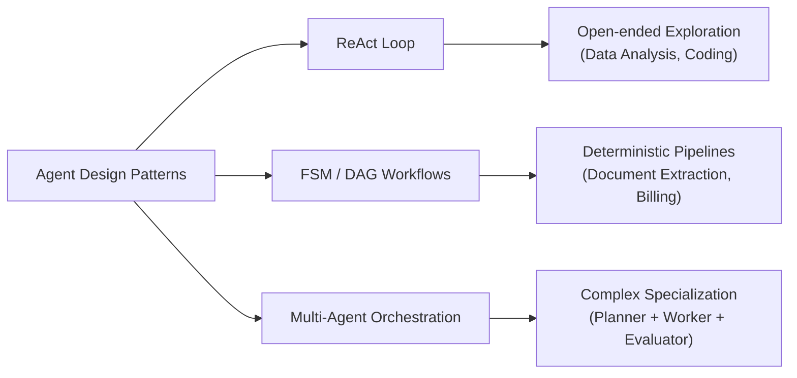

# Building Autonomous AI Agents: Architecture, Parameterization, and Implementation Master Guide

This document is a comprehensive, production-grade guide for designing, parameterizing, and building autonomous AI agents. It spans fundamental paradigms, minimal architectures, configuration parameterization, core architectural facets, and a step-by-step implementation roadmap.

---

## 1. Agent Paradigms & Architecture Spectrum

An **AI Agent** is an autonomous system that uses a Cognitive Engine (LLM) to perceive environment state, reason about goals, execute tools/actions, observe results, and iterate until a objective is achieved.

```
       ┌─────────────────────────────────────────────────────────┐
       │                 User Goal / Environment                 │
       └──────────────────────────┬──────────────────────────────┘
                                  │
                                  ▼
┌───────────────────────────────────────────────────────────────────────┐
│                           AGENT CONTROL LOOP                          │
│                                                                       │
│  ┌────────────────────┐   Prompt    ┌──────────────────────────────┐  │
│  │   Context Engine   ├────────────►│       Cognitive Brain        │  │
│  │ (Memory, SOP, State│             │ (LLM + Tool Manifests)       │  │
│  └─────────▲──────────┘             └──────────────┬───────────────┘  │
│            │                                       │ Tool Call        │
│            │ Observation                           ▼                  │
│  ┌─────────┴──────────┐             ┌──────────────────────────────┐  │
│  │ Guardrails & State ├─────────────┤    Tool Execution Sandbox    │  │
│  │    Checkpoints     │◄────────────┤ (Python, DB, Terminal, APIs) │  │
│  └────────────────────┘ Output/Err  └──────────────────────────────┘  │
└───────────────────────────────────────────────────────────────────────┘
```

### Core Architectural Paradigms



1. **ReAct (Reasoning and Acting)**:
   - *Mechanism*: An iterative `while` loop where the LLM produces thoughts and tool invocations, receives tool execution feedback (observations), and updates its internal plan dynamically.
   - *Best For*: Exploratory tasks, data analysis, software debugging, complex problem solving.

2. **Finite State Machines (FSMs) & Directed Acyclic Graphs (DAGs)**:
   - *Mechanism*: Control flow is hardcoded into state nodes; LLMs evaluate specific transitions or extract structured outputs within nodes.
   - *Best For*: Highly regulated, deterministic business processes (e.g., invoice processing, KYC validation).

3. **Multi-Agent Orchestration**:
   - *Mechanism*: Specialized agents (e.g., Planner, Coder, Reviewer) delegate tasks to one another via structured message passing.
   - *Best For*: Large scope tasks where context isolation prevents context-window bloat.

---

## 2. The Simplest Agent Architecture

The simplest viable agent is a **Single-Loop ReAct Agent** written in pure Python. It requires zero complex frameworks (like standard LangChain) and relies on four clean primitives:
1. **System Prompt**: Defines persona and tool usage guidelines.
2. **LLM Client Abstraction**: Sends messages and tool schemas to the model API.
3. **Bounded `while` Loop**: Controls iteration with a mandatory `max_loops` safety threshold.
4. **Tool Dispatcher**: Maps tool calls to executable Python functions.

### Production-Grade Minimal Implementation Example

```python
import json
from typing import Dict, Any, List, Callable

class MinimalAgent:
    """
    A minimal, self-contained ReAct agent with explicit loop safety
    and provider-agnostic tool execution.
    """
    def __init__(
        self,
        llm_client: Any,
        tools: Dict[str, Callable],
        system_prompt: str,
        max_loops: int = 10
    ):
        self.client = llm_client
        self.tools = tools
        self.system_prompt = system_prompt
        self.max_loops = max_loops

    def run(self, user_query: str) -> str:
        # Initialize conversation state with cached static prompt prefix
        messages = [
            {"role": "system", "content": self.system_prompt},
            {"role": "user", "content": user_query}
        ]

        for loop_idx in range(1, self.max_loops + 1):
            print(f"[Loop {loop_idx}/{self.max_loops}] Calling LLM...")
            
            # 1. Reason: Request model output with tool schemas
            response = self.client.generate(messages=messages, tools=self.get_tool_schemas())

            # 2. Check for Final Answer
            if response.final_answer:
                print(f"[Completed] Final answer produced on step {loop_idx}.")
                return response.final_answer

            # 3. Extract Tool Request
            tool_call = response.tool_call
            tool_name = tool_call.name
            tool_args = tool_call.arguments
            print(f"[Action] Requesting tool: {tool_name}({tool_args})")

            # 4. Act: Execute Tool Safely
            if tool_name in self.tools:
                try:
                    observation = self.tools[tool_name](**tool_args)
                    status = "SUCCESS"
                except Exception as e:
                    observation = f"Tool Execution Error: {str(e)}"
                    status = "ERROR"
            else:
                observation = f"Error: Tool '{tool_name}' is not registered."
                status = "NOT_FOUND"

            # 5. Observe: Append turn state to history
            messages.append({
                "role": "assistant",
                "tool_calls": [{"id": tool_call.id, "name": tool_name, "arguments": tool_args}]
            })
            messages.append({
                "role": "tool",
                "tool_call_id": tool_call.id,
                "content": str(observation)
            })

        return f"Agent stopped: Exceeded maximum safety threshold of {self.max_loops} loops."

    def get_tool_schemas(self) -> List[Dict[str, Any]]:
        # Returns JSON Schema representation of registered tools
        return [fn._json_schema for fn in self.tools.values() if hasattr(fn, "_json_schema")]
```

> [!IMPORTANT]
> **ReAct Loop Safety Rule**: Never run an unbounded autonomous `while True:` loop. Always specify an explicit `max_loops` threshold (e.g., 10–15 steps) to prevent catastrophic token burn during hallucination or tool failure loops.

---

## 3. Parameterization & Configuration Management

To keep agent code modular, maintainable, and configurable across dev, staging, and production, decouple execution logic from agent metadata using a declarative YAML/JSON configuration spec.

### Parameterization Matrix

| Configuration Category | Parameter Key | Example Values | Purpose & Benefit |
| :--- | :--- | :--- | :--- |
| **Model Specification** | `provider` | `anthropic`, `openai`, `huggingface` | Provider agnosticism; swap LLM vendors seamlessly. |
| | `model_name` | `claude-3-5-sonnet`, `qwen2.5-72b` | Cost vs. intelligence tuning based on task complexity. |
| | `temperature` | `0.0` (code/data) to `0.7` (writing) | Control output determinism and creativity. |
| | `max_tokens` | `4096` | Upper bound for single-turn token output. |
| **Control Guardrails** | `max_loops` | `10` – `15` | Hard limit on ReAct loop execution turns. |
| | `execution_timeout` | `30` (seconds) | Subprocess / API execution timeout limit. |
| | `hitl_threshold` | `3` (consecutive failures) | Trigger Human-in-the-Loop intervention after failures. |
| | `use_checklist` | `true` / `false` | Enable/disable token-taxing state guardrails dynamically. |
| **Behavior & System Prompts**| `base_prompt_path` | `prompts/system_base.md` | Keep prompts in external files under version control. |
| | `sop_directory` | `sops/` | Location of declarative Standard Operating Procedures. |
| **Tool Registry & Sandbox** | `sandbox_type` | `subprocess`, `docker`, `e2b` | Environment isolation level based on deployment trust. |
| | `enabled_tools` | `["execute_python", "manage_checklist"]` | Dynamic feature flagging of available tools per agent role. |
| **Memory & Resiliency** | `context_pruning_limit` | `100000` (tokens) | Threshold to trigger context summarization. |
| | `persistence_backend` | `sqlite`, `jsonl`, `redis` | Session state storage for checkpointing and crash recovery. |

### Complete Declarative Specification Schema (`spec.yaml`)

```yaml
agent:
  name: "data_analyst"
  version: "1.0.0"
  description: "Autonomous data analysis and visual chart generation agent"

model:
  provider: "anthropic" # Fallback: huggingface
  model_name: "claude-3-5-sonnet-20241022"
  temperature: 0.0
  max_tokens: 4096

guardrails:
  max_loops: 15
  execution_timeout_seconds: 30
  hitl_on_consecutive_errors: 3
  use_checklist: false # Save token tax on frontier models

paths:
  base_prompt: "data_analyst/prompts/base_system.md"
  sop_dir: "data_analyst/sops/"
  output_dir: "data_analyst/outputs/"

execution:
  sandbox: "docker" # Options: subprocess, docker, e2b
  enabled_tools:
    - "execute_python"
    - "manage_checklist"

memory:
  context_prune_threshold_tokens: 100000
  checkpoint_enabled: true
  checkpoint_backend: "jsonl"
```

---

## 4. Deep Dive: The 6 Key Architectural Facets

```
┌────────────────────────────────────────────────────────────────────────┐
│                        6. Observability & Tracing                      │
│        (Dual Transcripts: transcript.jsonl / transcript_full.jsonl)    │
├────────────────────────────────────────────────────────────────────────┤
│ 1. Cognitive Brain       │ 2. Control & Orchestration                  │
│    - BaseLLMClient       │    - ReAct Loop Engine                      │
│    - Prompt Engineering  │    - State Machines / FSM                   │
│    - Structured Outputs  │    - Human-in-the-Loop Triggers             │
├──────────────────────────┼─────────────────────────────────────────────┤
│ 3. Tool & Execution      │ 4. Memory & Context                         │
│    - Pydantic Schemas    │    - Short-Term Conversation History         │
│    - Docker / Subprocess │    - State Hydration & Checkpoints           │
│    - Permission Rails    │    - Declarative SOP / Prompt-RAG            │
├──────────────────────────┴─────────────────────────────────────────────┤
│ 5. Security, Safety & Token Tax Guardrails                             │
│    - Hard Max Loop Threshold  - Conditional Checklist Guardrails       │
└────────────────────────────────────────────────────────────────────────┘
```

### Facet 1: The Cognitive Brain (Model Abstraction & Prompt Caching)
- **Provider Agnosticism**: Abstract model providers behind a unified interface (`BaseLLMClient`). The application logic should never directly invoke vendor SDKs.
- **Prompt Caching Friendliness**: Place static instructions (system prompts, tool definitions) at the **very beginning** of the prompt payload. Keep this prefix static across turns so LLM providers (Anthropic, Gemini) can cache tokens, reducing cost and latency by up to 80%.
- **Structured Outputs**: Never parse model output using custom regex or string splitting. Always rely on native API tool calling or Pydantic/JSON schema enforcement at the boundary.

### Facet 2: Control & Orchestration Engine
- Controls execution transitions between steps.
- Supports **Human-in-the-Loop (HITL)** triggers: when an agent experiences $N$ consecutive tool failures, the loop pauses and requests human intervention rather than exhausting `max_loops`.

### Facet 3: Tool & Execution Isolation (Sandboxing)
- **Environment Isolation**: Never run agent-generated code or commands directly on the host host machine in production.
- **Isolation Hierarchy**:
  1. *Subprocess (Local Dev)*: Fast execution, restricted timeouts, restricted environment.
  2. *Docker / MicroVM (Production)*: Ephemeral containers with read-only root filesystems and restricted network interfaces.
  3. *E2B / Cloud Sandboxes*: Dedicated remote execution environments for multi-tenant SaaS applications.

### Facet 4: Memory, Context & State Hydration
- **Short-Term History**: Conversation thread maintained in context.
- **Context Pruning**: When conversation length approaches token limits, summarize older turns while retaining recent assistant turns and initial system instructions.
- **State Hydration & Checkpoints**: Record a persistent state record (e.g. `checkpoint_step_04.json`) after each turn. If the process crashes or encounters a network partition, the agent can rehydrate its state and resume from the last known good checkpoint.
- **Declarative SOPs & Dynamic Injection**: Keep base prompts minimal. Store procedural runbooks as standalone markdown files (`sops/data_cleaning.md`) and dynamically inject only the SOP relevant to the user request.

### Facet 5: Security, Safety & Guardrails
- **The Token Tax Principle**: Do not force intelligent frontier models to execute verbose state management tools (like explicit checklist tools) if their intrinsic reasoning is sufficient. Make these guardrails configurable (`use_checklist: false`).
- **Hard Safety Limits**: Enforce execution time limits and step caps at the code level, independent of LLM choices.

### Facet 6: Observability, Tracing & Dual Transcripts
Maintain a **Dual-Transcript Strategy** for debugging and trajectory analysis:
1. `transcript.jsonl`: Truncated, lightweight event log for fast daily monitoring and log indexing.
2. `transcript_full.jsonl`: Untruncated, exact raw payload log containing full system prompts, tool schemas, and model completions for deep trajectory replay.

---

## 5. Stepwise Guide to Design & Build an Agent

Follow this 7-step roadmap to build an agent from design to deployment:

```
Step 1: Define Scope ──► Step 2: Build Abstractions ──► Step 3: Tool Schemas
                                                               │
                                                               ▼
Step 6: Resilience & ◄── Step 5: Externalize Config ◄── Step 4: Core ReAct Loop
   Checkpoints                & SOPs
     │
     ▼
Step 7: Observability & Evaluation
```

### Step 1: Define Problem Scope & Workflow Pattern
- Identify if the task requires open exploration (ReAct loop) or a rigid state flow (FSM/DAG).
- Define input parameters, expected output schemas, and allowed tools.

### Step 2: Build the Provider-Agnostic LLM Interface
- Implement a `BaseLLMClient` class that normalizes requests across Anthropic, OpenAI, or open-source endpoints.

### Step 3: Define Schema-Enforced Tools & Isolated Executors
- Create tools with explicit JSON/Pydantic schemas.
- Implement an executor wrapper (e.g., `PythonExecutor`) with timeout handling.

### Step 4: Construct the Bounded ReAct Control Loop
- Implement the core execution loop bounded by `max_loops`.
- Handle final answer detection, tool call dispatching, and observation feedback.

### Step 5: Externalize Configuration & Declarative SOPs
- Create `spec.yaml` to configure model parameters, thresholds, and paths.
- Create standalone markdown SOPs and a dynamic routing mechanism.

### Step 6: Implement Resiliency, State Checkpointing & Context Pruning
- Add turn-by-turn state persistence (`checkpoint.json`).
- Implement context pruning logic to summarize older conversation steps when context limits are reached.

### Step 7: Instrument Dual-Transcript Logging & Benchmark Trajectories
- Implement dual-transcript logging (`transcript.jsonl` and `transcript_full.jsonl`).
- Create test trajectory benchmarks to evaluate agent completion rates, loop counts, and costs.

---

## 6. Real-World Architecture Reference (Workspace Alignment)

Our workspace implementation provides concrete examples of these architectural concepts:

1. **Provider-Agnostic LLM Engine**:
   - Implemented in [core/llm_clients.py](file:///home/navin/work/AI/projects/Agents/core/llm_clients.py). Demonstrates multi-provider support (Anthropic and Hugging Face) with context pruning.

2. **Declarative Specification**:
   - Implemented in [data_analyst/spec.yaml](file:///home/navin/work/AI/projects/Agents/data_analyst/spec.yaml). Demonstrates YAML-based agent parameterization.

3. **ReAct Control Loop & Execution**:
   - Implemented in [data_analyst/agent.py](file:///home/navin/work/AI/projects/Agents/data_analyst/agent.py). Demonstrates a bounded ReAct loop with tool dispatching.

4. **Subprocess Tool Execution**:
   - Implemented in [data_analyst/executor.py](file:///home/navin/work/AI/projects/Agents/data_analyst/executor.py). Demonstrates isolated code execution with plot interception and timeouts.

5. **Declarative SOP Workflows**:
   - Implemented in [data_analyst/sops/](file:///home/navin/work/AI/projects/Agents/data_analyst/sops/) and routed via [data_analyst/sops.py](file:///home/navin/work/AI/projects/Agents/data_analyst/sops.py).

6. **Skills Ecosystem**:
   - Detailed specification in [skills_architecture.md](file:///home/navin/work/AI/projects/Agents/docs/skills_architecture.md). Demonstrates modular skill package loading and registration.
