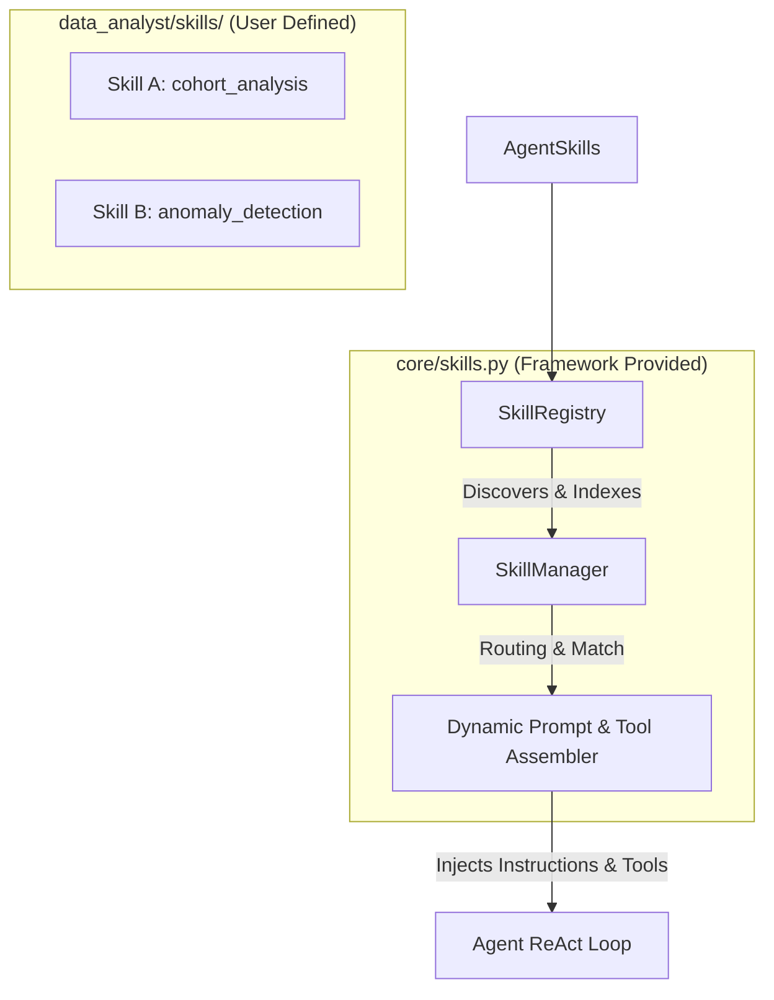
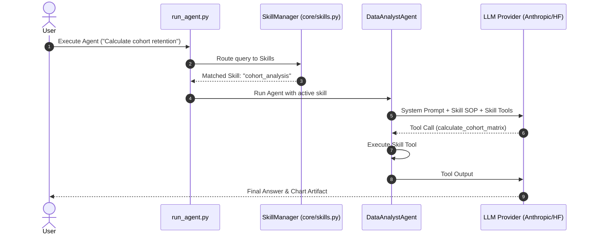

# Agent Ecosystem: Autonomous Agent Architecture & Modular Skills Specification

This document provides a comprehensive architectural specification for building modular, autonomous AI agents with dynamic **Skill Capabilities**.

---

## 1. Overview of Skills Architecture

In modern agentic AI systems, a **Skill** is a self-contained, modular package that equips an agent with specialized knowledge, procedural guidelines, and executable tools for a specific domain.

Rather than hardcoding all prompt rules, tools, and SOPs into a single monolithic system prompt, the framework uses a **Modular Skills System**:
- **Framework-Provided Core (`core/skills.py`)**: `SkillRegistry` (discovery & indexing) and `SkillManager` (dynamic loader & router).
- **User-Defined Skills (`<agent>/skills/<skill_name>/`)**: Modular packages created by developers containing instructions (`SKILL.md`), executable Python tools (`tools.py`), and templates/resources.

---

## 2. Structural Alignment with Standard Customizations

The framework's skill layout strictly mirrors standard agent customization patterns (such as IDE agent skills and team SOP specifications):

```
projects/Agents/
├── core/
│   ├── skills.py                   # Framework Engine: SkillRegistry & SkillManager
│   └── ...
│
└── data_analyst/
    └── skills/                     # Agent-Specific Skills Directory
        ├── cohort_analysis/
        │   ├── SKILL.md            # Frontmatter metadata + Procedural Instructions
        │   ├── tools.py            # Executable Python tools for cohort analysis
        │   └── templates/          # SQL/Notebook templates
        │
        └── anomaly_detection/
            ├── SKILL.md
            ├── tools.py
            └── resources/
```

### The `SKILL.md` Specification

Every skill directory must contain a `SKILL.md` file formatted with **YAML Frontmatter** followed by a **Markdown Instruction Body**:

```markdown
---
name: cohort_analysis
description: Performs user retention cohort analysis and generates matrix visualization plots.
keywords: [cohort, retention, churn, cohort analysis, matrix]
required_tools: [calculate_cohort_matrix, plot_cohort_heatmap]
version: 1.0.0
---

# Skill: Cohort Retention Analysis

When performing cohort retention analysis:

1. **Group by Acquisition Cohort**:
   - Extract user acquisition month/week as the cohort identifier.
   - Calculate period index (Month 0, Month 1, Month 2...).

2. **Calculate Retention Matrix**:
   - Use `calculate_cohort_matrix` to compute percentages.
   - Format values as percentages with 1 decimal place.

3. **Visualize**:
   - Generate a heatmap visualization using `plot_cohort_heatmap` saved to `outputs/`.
```

---

## 3. Core Framework Components: Framework-Provided vs. User-Defined



### A. `SkillRegistry` (Framework Provided)
- **Automatic Discovery**: Scans `skills/` directories on startup (both shared framework skills in `core/skills/` and agent-specific skills in `<agent>/skills/`).
- **Metadata Indexing**: Reads YAML frontmatter from all `SKILL.md` files and caches skill definitions in memory.

### B. `SkillManager` (Framework Provided)
- **Query Routing**: Evaluates user queries against registered skills using keyword matching or semantic embeddings.
- **Dynamic Context Assembly**:
  - Injects matched skill instructions into the LLM system prompt.
  - Merges skill-specific tool schemas (`tools.py`) into the active LLM toolset for that turn.

### C. Skill Packages (User Defined)
- Individual skills created by developers to add new capabilities to an agent without modifying core loop code.

---

## 4. Execution Mechanisms: In-Process vs. Sub-Agent Delegation

When a skill is triggered by the `SkillManager`, it can execute in one of two modes depending on complexity:

### Mode 1: In-Process Skill Execution (Default)
- **Mechanism**: The skill's instructions (`SKILL.md`) and tools (`tools.py`) are loaded directly into the main agent's active ReAct loop.
- **Best Used For**: Standard tasks, data transformations, chart rendering, single-step queries.

### Mode 2: Sub-Agent Delegation
- **Mechanism**: The main agent spawns a temporary, isolated child `Agent` instance dedicated exclusively to that skill.
- **Workflow**:
  1. Main agent calls a delegation tool (e.g. `invoke_subagent(skill="cohort_analysis", task="...")`).
  2. Child agent runs its own ReAct loop with a clean context window.
  3. Child agent returns the synthesized result back to the main agent.
- **Best Used For**: Long-running sub-tasks, multi-file code editing, deep multi-turn research, or operations requiring strict context isolation.

---

## 5. Lifecycle of a Skill Execution


